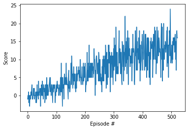

# Report for Project 1 of the Udacity Deep Reinforcement Learning course.

This report provides a short description of my implementation.


## Learing Algorithm

A Deep Reinforcement Agent was developed to solve the task of collecting as many yellow bananas as possible.
The implementation is based on the "Deep Q-Learning Algoithm", which has already been implemented in a previous exercise.

Agent Hyperparameters
```
BUFFER_SIZE = int(1e5)  # replay buffer size
BATCH_SIZE = 64         # minibatch size
GAMMA = 0.99            # discount factor
TAU = 1e-3              # for soft update of target parameters
LR = 5e-4               # learning rate
UPDATE_EVERY = 4        # how often to update the network
```

Neural Network Hyperparameters
```
STATE_SIZE = 37
ACTION_SIZE = 4
```

Neural Network Architectures
```
QNetwork(
  Linear(in_features=STATE_SIZE, out_features=64)
  ReLU()
  Linear(in_features=64, out_features=64)
  ReLU()
  Linear(in_features=64, out_features=ACTION_SIZE)
)
```


## Plot of Rewards

The environment reached an average reward of 13 over the last 100 episodes in episode 522 and was therefore solved in episode 422.




## Ideas for Future Work

- Try different network architectures
- Implement DQN extensions
  - double DQN
  - dueling DQN
  - prioritized experience replay
- Use up-to-date software
