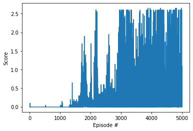

# Report for Project 3 of the Udacity Deep Reinforcement Learning course.

This report provides a short description of my implementation.

## Learing Algorithm

A Deep Reinforcement Agent was designed to solve the task of bouncing a ball over a net by controlling the rackets of two agents.
The implementation is based on the Deep Deterministic Policy Gradients (DDPG) algorithm.

DDPG is a model-free, off-policy actor-critic algorithm (Lillicrap et al., 2016) based on the Deep Q-Networks (DQN) (Mnih et al., 2015) algorithm and Deterministic Policy Gradient (DPG) algorithm (Silver et al., 2014).

The main techniques of DDPG are Experience Replay, Fixed Q-Targets, Actor-Critic and exploring the continuous action space by adding noise to the action output.

1. Experience Replay is implemented by a replay buffer, which is used to store experience while executing a policy in an environment.
The replay buffer stores the most recent experiences, including the state, action, reward, next state, and done, in a size-limited queue.
The network is trained off-policy with randomly sampled experiences from the replay buffer to "replay" the agent's recent experiences.

2. Fixed Q-Targets are implemented by a second neural network, which is called target network.
Instead of using the policy network a second time to calculate the target Q-Values, we use the temporarily fixed target network.
The target network is a clone of the policy network, has its own weights, and is softly updated at each step with the weighted (hyperparameter `TAU`) weights of the policy network.

3. Actor-critic architectures consist of an actor and a critic network.
The actor decides which action to perform and the critic evaluates how good the action was and how it should be improved.
The action performed by the actor is evaluated by computing the state value function with the critic network.
In DDPG, there is also one target network each for the actor and the critic, which follows the strategy of fixed Q-Targets.

4. Exploration in DDPG is done using the Ornstein-Uhlenbeck process, which adds noise to the action output.

The same actor and critc networks are used to control both rackets.
Compared to the solution of the multi-agent version of the Reacher environment from the second DRLND project "Continuous Control", only the hyperparameters `BUFFER_SIZE` and `BATCH_SIZE` were increased about tenfold.
The larger replay buffer is to compensate for the increased information content due to two different agents to control.
The larger `BATCH_SIZE` shall stabilize the training because of the increased information content. 

**References**
- Deep Deterministic Policy Gradients (DDPG): [Continuous control with deep reinforcement learning (Lillicrap et al., 2016)](https://www.deepmind.com/publications/continuous-control-with-deep-reinforcement-learning)
- Deep Q-Networks (DQN): [Human Level Control Through Deep Reinforcement Learning (Mnih et al., 2015)](https://www.deepmind.com/publications/human-level-control-through-deep-reinforcement-learning)
- Deterministic Policy Gradient (DPG): [Deterministic Policy Gradient Algorithms (Silver et al., 2014)](https://www.deepmind.com/publications/deterministic-policy-gradient-algorithms)
- Multi-agent Reinforcement Learning (MARL) [Multi-Agent Actor-Critic for Mixed Cooperative-Competitive Environments (Ryan Lowe, et al.)](https://arxiv.org/abs/1706.02275)

**Learing Algorithm Steps**
1. Init the agent with state and action size:
   - Init actor policy and target networks and optimizer
   - Init critic policy and target networks and optimizer
   - Init noise generator
   - Init replay buffer
2. For each episode:
   1. Get the initial state by resetting the environment
   2. For each step
      1. Select action by feeding state to the actor network.  
         Exploitation is done using the Ornstein-Uhlenbeck process, which adds noise to the action output
      2. Execute the selected action in the environment
      3. Observe next state, reward and if it's a final state.
      4. Store experiences in the replay buffer
      5. Learn from observed experiences if replay buffer contains enough samples
         1. Sample random experiences from replay buffer
         2. Update critc network
            1. Get next action with actor target network
            2. Get next Q values with critic target network
            3. Compute Q targets
            4. Get expected Q targets from critic network
            5. Compute MSE loss
            5. Update critic network with Adam optimizer
         3. Update actor network
            1. Get predicted action with actor network
            2. Get actor loss with critic network
            3. Update actor network with Adam optimizer
         4. Update target networks with soft update strategy

**Agent Hyperparameters**
```
BUFFER_SIZE = int(1e6)  # replay buffer size
BATCH_SIZE = 1024       # minibatch size
GAMMA = 0.99            # discount factor
TAU = 1e-3              # for soft update of target parameters
LR_ACTOR = 1e-4         # learning rate of the actor
LR_CRITIC = 1e-3        # learning rate of the critic
WEIGHT_DECAY = 0        # L2 weight decay
```

**Neural Network Hyperparameters**
```
STATE_SIZE = 24
ACTION_SIZE = 2
```

**Neural Network Architectures**
```
Actor(
  (fc1): Linear(in_features=24, out_features=400, bias=True)
  (fc2): Linear(in_features=400, out_features=300, bias=True)
  (fc3): Linear(in_features=300, out_features=2, bias=True)
)
Critic(
  (fcs1): Linear(in_features=24, out_features=400, bias=True)
  (fc2): Linear(in_features=402, out_features=300, bias=True)
  (fc3): Linear(in_features=300, out_features=1, bias=True)
)
```

## Plot of Rewards

The environment reached an average reward of 0.804 over the last 100 episodes over all agents in episode 2918 and was therefore solved in episode 3018.



## Ideas for Future Work

- Try separate networks or buffers for each agent
- Try different hyperparameters / neural network architectures
- Try more advanced architectures/stategies
  - A2C/A3C
  - D4PG
  - GAE
  - PPO
- Use up-to-date software/libraries
